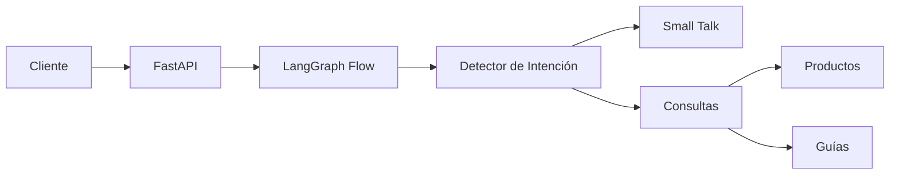

# 🎨 Paint Shop Chatbot Demo

## 🤖 Descripción
Demo de un chatbot especializado en atención al cliente para una tienda de pinturas. Utiliza LangGraph para manejar el flujo de conversación y Cohere para el procesamiento de lenguaje natural.

## 🏗️ Arquitectura


## 🔧 Componentes Principales
- **FastAPI**: API REST + Interfaz web simple
- **LangGraph**: Orquestación del flujo de conversación  
- **Cohere**: LLM para procesamiento y generación de respuestas
- **Chroma**: Vector store para búsqueda semántica de productos/guías

## 🚀 Quick Start

1. Clona el repo
```bash
git clone <repo-url>
```

2. Instala dependencias
```bash
pip install -r requirements.txt
```

3. Configura variables de entorno
```bash
COHERE_API_KEY=your-key-here
CHROMA_PERSIST_DIR=./chroma_db
```

4. Ejecuta el servidor
```bash
uvicorn main:app --reload
```

5. Abre http://localhost:8000 en tu navegador

## 💬 Flujo de Conversación

1. El sistema detecta si el mensaje es small talk o una consulta
2. Para consultas, clasifica si es sobre productos o guías
3. Busca en la base de conocimiento relevante usando embeddings
4. Genera una respuesta contextual

## 🔍 Puntos Interesantes

- Uso de RAG (Retrieval Augmented Generation)
- Flujo de conversación basado en grafos
- Embeddings multilingües
- Interfaz web minimalista para testing

## 📝 Notas
- Demo project - No para producción
- Base de conocimiento limitada
- Sin manejo de sesiones persistentes  
- Respuestas en español únicamente

## 🛠️ Tech Stack
- Python 3.9+
- FastAPI
- LangGraph
- Cohere
- Chroma
- AdminLTE (UI)

## 👥 Contribuir
Es un proyecto demo, pero si encuentras bugs o tienes sugerencias, ¡abre un issue!